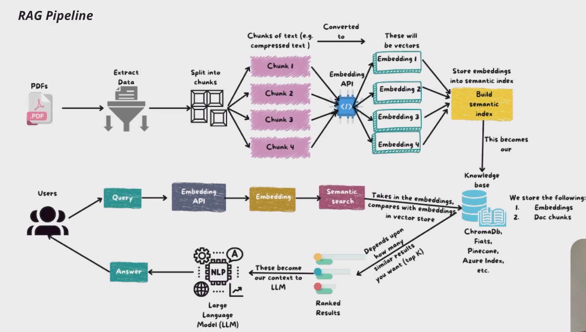

# RAG Pipeline — Retrieval-Augmented Generation from Scratch

A end-to-end **Retrieval-Augmented Generation (RAG)** pipeline built with LangChain, Sentence-Transformers, and ChromaDB — with generation tested against both **OpenAI (GPT)** and **Groq (Qwen)** LLMs.

This project walks through the three core stages of RAG — **Ingestion → Retrieval → Generation** — from raw text/PDF files all the way to an LLM producing grounded, context-aware answers.

## Architecture



## Why RAG?

A plain LLM answers only from what it learned during training — so it can hallucinate, go out of date, or know nothing about your private documents. RAG fixes this by fetching relevant chunks from your own data at query time and feeding them to the LLM as context before it generates an answer.

**Key benefits:**
- **Reduces hallucinations** — answers are grounded in retrieved source text instead of the model guessing
- **Up-to-date & domain-specific** — works with your own PDFs/docs instead of only the model's training data
- **Traceable** — every answer can be linked back to the source chunk/document it came from
- **No fine-tuning needed** — swap or update the knowledge base anytime without retraining the LLM

## Pipeline Overview

### 1. Ingestion
- Raw text and PDF files are loaded using `TextLoader`, `PyPDFLoader`, and `PyMuPDFLoader` and converted into LangChain `Document` objects (`page_content` + `metadata`).
- Documents are split into smaller chunks using `RecursiveCharacterTextSplitter` (chunk size 500, overlap 50) so they fit cleanly into an embedding model's context.
- Each chunk is embedded using **Sentence-Transformers (`all-MiniLM-L6-v2`, 384 dimensions)**.
- Embeddings + chunk text + metadata are stored in a persistent **ChromaDB** collection.

### 2. Retrieval
- The user's query is embedded using the same MiniLM model.
- ChromaDB performs a similarity search and returns the **top-k** most relevant chunks, ranked using **cosine similarity** (`1 - distance`).
- Results below a configurable similarity threshold can be filtered out.

### 3. Generation
- The retrieved chunks are joined into a single context block and combined with the user's query into a prompt.
- The prompt is sent to an LLM to generate the final, context-grounded answer.
- Tested with two providers:
  - **OpenAI GPT** via `langchain-openai`
  - **Groq (Qwen)** via `langchain-groq`
- (Anthropic Claude integration scaffolded, easy to plug in via `langchain-anthropic`.)

## Tech Stack

| Component | Tool |
|---|---|
| Orchestration | LangChain |
| Document Loading | PyPDFLoader, PyMuPDFLoader, TextLoader |
| Chunking | RecursiveCharacterTextSplitter |
| Embeddings | Sentence-Transformers (`all-MiniLM-L6-v2`) |
| Vector Store | ChromaDB |
| Similarity Metric | Cosine Similarity |
| LLMs | OpenAI GPT, Groq (Qwen) |

## Project Structure

```
├── data/
│   ├── Python.txt              # sample text source
│   ├── pdfs/                   # source PDFs for ingestion
│   └── vector_store/           # persisted ChromaDB collection
├── Architectures/
│   └── RAG_ARCHITECTURE.png    # pipeline architecture diagram
└── RAG_Pipeline.ipynb          # main notebook: ingestion → retrieval → generation
```

## Setup

```bash
pip install langchain langchain-core langchain-community pypdf pymupdf sentence-transformers chromadb langchain-openai langchain-groq
```

Add your API keys for whichever LLM provider you want to use (OpenAI and/or Groq) before running the generation step.

## Usage

1. Drop your text/PDF files into `data/` and `data/pdfs/`.
2. Run the ingestion cells to chunk, embed, and store documents in ChromaDB.
3. Query the `RAGRetriever` to fetch the top-k relevant chunks for a question.
4. Pass the retrieved context + query to `generate_output()` to get a grounded answer from the LLM.

## RAG vs. a Plain LLM

| | Plain LLM | RAG-enhanced LLM |
|---|---|---|
| Knowledge source | Frozen training data only | Training data + your live document store |
| Hallucination risk | Higher | Lower — answers are grounded in retrieved text |
| Domain/private data | Not aware of it | Can answer from your own PDFs/docs |
| Update process | Requires retraining | Just re-ingest new documents |

## Future Improvements
- Add a reranker on top of the top-k retrieved chunks
- Add source citations in the final generated answer
- Wire up Claude via `langchain-anthropic`
- Expose the pipeline through a simple API/UI

## Author
Built by [Amit](https://github.com/amit-sharma-ds) as part of an ongoing AI/ML project portfolio.
